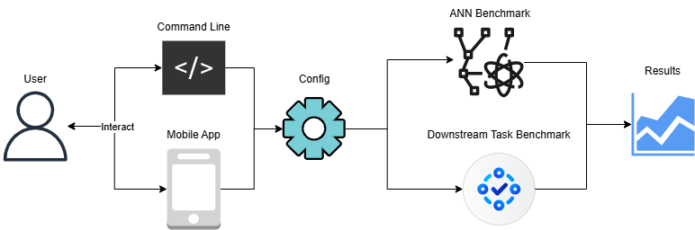

# MoRAGBench: A Benchmarking Framework for RAG Pipelines on Mobile Devices

**MoRAGBench** is an open-source framework for benchmarking **Retrieval-Augmented Generation (RAG) pipelines on mobile devices**.

The framework enables systematic evaluation of RAG components running **entirely on Android smartphones**, allowing researchers and developers to measure performance under realistic mobile constraints such as:

- limited compute resources
- memory pressure
- heterogeneous hardware accelerators

MoRAGBench provides a **fully modular architecture** that allows users to configure each stage of the RAG pipeline and evaluate how different design choices affect:

- **Recall@k**
- **Latency**
- **Throughput**
- **Memory consumption**
- **Downstream task accuracy**

---

# Table of Contents

- [Key Features](#key-features)
- [Installation](#installation)
    - [Requirements](#requirements)
    - [Download Dependencies](#download-dependencies)
    - [Download Artifacts](#download-artifacts)
    - [Build Android Application](#build-android-application)
- [Running MoRAGBench](#running-moragbench)
    - [Preparation](#preparation)
    - [Running the Mobile Application](#running-the-mobile-application)
    - [Running a Benchmark](#running-a-benchmark)
- [Benchmark Types](#benchmark-types)
    - [ANN Benchmark](#ann-benchmark)
    - [Downstream Task Benchmark](#downstream-task-benchmark)
- [Configuration Reference](#configuration-reference)
    - [ANN Dataset Configuration](#ann-dataset-configuration)
    - [FAISS Configuration](#faiss-configuration)
    - [Method-Specific FAISS Parameters](#method-specific-faiss-parameters)
    - [Downstream Task Configuration](#downstream-task-configuration)
    - [RAG Pipeline Configuration](#rag-pipeline-configuration)
- [Running Experiments](#running-experiments)
- [Roadmap](#roadmap--to-do)
- [Paper & Citation](#paper--citation)

---

# Key Features

## 📱 Mobile-Centric RAG Benchmarking

MoRAGBench focuses specifically on **on-device RAG pipelines running on smartphones**.

Unlike most benchmarking frameworks designed for server environments, MoRAGBench evaluates how RAG components behave under **mobile hardware constraints**, including:

- CPU-only execution
- limited memory
- heterogeneous accelerators

---

## 🧩 Modular RAG Pipeline Architecture

MoRAGBench decomposes the RAG pipeline into modular components:

- Text Chunking
- Embedding Generation
- Vector Indexing & Retrieval
- Context Augmentation
- LLM Generation

Each component is exposed through configurable interfaces, allowing users to easily experiment with different pipeline configurations **without modifying the core system logic**.

---

## 📊 Two Complementary Benchmark Types

MoRAGBench provides two benchmark modes that analyze different aspects of RAG systems.

### ANN Benchmark

Evaluates **vector indexing and retrieval performance in isolation**.

Metrics include:

- Recall@k
- Retrieval latency
- Queries per second (QPS)
- Index construction time
- Memory usage

---

### Task Benchmark

Evaluates the **complete end-to-end RAG pipeline** using question-answering datasets.

Metrics include:

- Exact Match (EM)
- F1 Score
- BLEU
- ROUGE
- Contains metric
- Token throughput
- Latency breakdown
- Memory consumption

---

## ⚙️ Hardware-Aware Evaluation

MoRAGBench supports benchmarking across different mobile inference backends:

- CPU
- XNNPACK
- NNAPI (GPU/NPU acceleration)

This enables analysis of how hardware accelerators influence:

- embedding performance
- retrieval latency
- LLM inference speed

---

## 🔬 System-Level Performance Analysis

MoRAGBench measures multiple system-level metrics to analyze RAG pipeline efficiency:

- Throughput (QPS)
- Time-to-first-token (TTFT)
- Generation throughput (tokens/sec)
- Peak and average memory usage
- Component-level latency breakdowns

These measurements help identify **performance bottlenecks across the entire pipeline**.

---

# Installation

## Requirements

- Android device (**Android 11+ recommended**)
- Python **3.9+**
- Android Studio
- ADB (Android Debug Bridge)

---

## Download Dependencies

Create a Python virtual environment:
```bash
python3 -m venv .venv
# Activate the environment
source ./venv/bin/activate
```

Install the dependencies:
```bash
pip install -r requirements.txt
```

---

## Download Artifacts

Download binary files and `.onnx` models.

The following command downloads a zip file (~2.75GB) and places the binary files in their correct location:

```bash
python3 download.py
```

---

## Build Android Application

1. Open the Android project in **Android Studio**.
2. Sync Gradle.
3. Allow Android Studio to download all required dependencies.

---

# Running MoRAGBench



MoRAGBench provides **two entry points**:

1. **Mobile Application**
2. **CLI Benchmark Interface**

Both allow users to configure and run complete RAG pipelines.

The mobile app exposes a **chat interface**, enabling interactive LLM queries.

The CLI module follows a **client–server architecture**:

- The **Android application** acts as the benchmark server.
- A **Python client**:
    - prepares datasets
    - transfers models
    - triggers benchmarks
    - collects metrics

---

## Preparation

Connect your Android device and verify the ADB connection:

```bash
adb devices
```

Ensure **USB debugging** is enabled on the device.

---

## Running the Mobile Application

1. Open the project in **Android Studio**.
2. Select **MainActivity** as the run target.
3. Click **Run**.

The first build may take several minutes.

You can put as many `.txt` files in this location: `./android/app/src/main/assets/input_files`. These text files will form the knowledge source of the mobile application.

---

## Running a Benchmark

Benchmarks are triggered using the **Python client scripts**.

The client automatically handles:

- downloading models
- downloading datasets
- transferring files to the device
- starting the benchmark
- collecting evaluation metrics

MoRAGBench supports two benchmark types:

- **ANN benchmarks**
- **Downstream task benchmarks**

---

# Benchmark Types

## ANN Benchmark

The ANN benchmark is adapted from the popular [ANN-Benchmarks project](https://github.com/erikbern/ann-benchmarks):

It isolates the **retrieval component** to analyze indexing trade-offs.

### Benchmark Procedure

1. Build the index using training vectors
2. For each test vector:
    - retrieve the top-k neighbors
    - compare them with ground truth neighbors
3. Report evaluation metrics

Metrics include:

- Recall@k
- Precision@k
- latency
- throughput

A **configuration file** is required to describe the retriever setup.

---

## Downstream Task Benchmark

This benchmark evaluates the **complete end-to-end RAG pipeline**.

The pipeline uses question-answering datasets as the knowledge source.

### Benchmark Procedure

1. Load all documents from a QA dataset
2. Chunk documents
3. Generate embeddings
4. Build the vector index
5. For each question:
    - embed the query
    - retrieve top-k neighbors
    - construct the prompt
    - generate an answer
6. Compute task metrics

Reported metrics include:

- task accuracy
- latency
- throughput
- memory usage

Configuration is provided through a **JSON configuration file**.

---

# Configuration Reference

## ANN Dataset Configuration

Controls which dataset is used for ANN benchmarking.

| Parameter | Type | Description | Supported Values |
| --- | --- | --- | --- |
| `name` | string | ANN dataset name | `deep1b`, `fashion_mnist`, `gist`, `glove_25`, `glove_50`, `glove_100`, `glove_200`, `kosarak`, `mnist`, `movielens_10m`, `ny_times`, `sift`, `last_fm`, `coco_i2i`, `coco_t2i` |
| `sampling_method` | string | Sampling strategy | `first_n`, `last_n`, `random` |
| `limit` | integer | Maximum number of vectors | `int > 0` |
| `seed` | integer | Random seed | any integer |

---

## FAISS Configuration

Controls how the **vector index is built and queried**.

| Parameter | Type | Description | Supported Values |
| --- | --- | --- | --- |
| `method` | string | Index type | `flat`, `ivf`, `hnsw` |
| `backend` | string | Execution backend | `cpu` |
| `metric` | string | Distance metric | `L2`, `IP` |
| `top_k` | integer | Number of retrieved neighbors | `int > 0` |
| `batch_size` | integer | Query batch size | `int > 0` |
| `config` | object | Method-specific parameters | varies (see below) |
| `use_cache` | boolean | Reuse existing index | `true`, `false` |

---

## Method-Specific FAISS Parameters

### Flat Index

Performs **exact nearest-neighbor search** and requires **no additional parameters**.

---

### IVF Index

| Parameter | Type | Description |
| --- | --- | --- |
| `nlist` | integer | Number of clusters |
| `nprobe` | integer | Number of clusters searched |
| `num_training_vectors` | integer | Training vectors used |

---

### HNSW Index

| Parameter | Type | Description |
| --- | --- | --- |
| `m` | integer | Connections per node |
| `ef_construction` | integer | Graph quality during construction |
| `ef_search` | integer | Search accuracy/speed trade-off |

---

### Example ANN Configuration

```json
{
  "ann_dataset": {
    "name":"fashion_mnist",
    "sampling_method":"first_n",
    "limit":10000,
    "seed":42
  },
  "faiss": {
    "method":"ivf",
    "backend":"cpu",
    "metric":"L2",
    "top_k":5,
    "batch_size":2000,
    "config": {
      "nlist":4000,
      "nprobe":80,
      "num_training_vectors":60000
    },
    "use_cache":false
  }
}
```

---

# Downstream Task Configuration

Controls the **QA dataset used for evaluation**.

| Parameter | Type | Description | Supported Values |
| --- | --- | --- | --- |
| `name` | string | QA dataset | `hotpot_qa`, `squad`, `trivia_qa` |
| `sampling_method` | string | Sampling strategy | `first_n`, `last_n`, `random` |
| `limit` | integer | Maximum dataset size | int >= `limit`; `-1` for unlimited |
| `corpus_limit` | integer | Number of documents included in the corpus | int > 0; `-1` for unlimited |

---

# RAG Pipeline Configuration

Defines the configuration of each pipeline component:

- embedding
- chunking
- vector retrieval
- LLM generation

---

## Embedding Configuration

| Parameter | Type | Description | Supported Values |
| --- | --- | --- | --- |
| `backend` | string | Inference backend | `cpu`, `xnnpack`, `nnapi` |
| `model_name` | string | Embedding model | `all-minilm-l6-v2`, `all-minilm-l12-v2` |
| `dtype` | string | Weight precision | `float32`, `int8` |

---

## Text Chunker Configuration

| Parameter | Type | Description | Supported Values |
| --- | --- | --- | --- |
| `method` | string | Chunking strategy | `token`, `word`, `character` |
| `size` | integer | Chunk size | `int > 0` |
| `overlap_enabled` | boolean | Enable chunk overlap | `true`, `false` |
| `overlap_size` | integer | Overlap length | `int ≥ 0` |

---

## LLM Configuration

Controls the **language model used for answer generation**.

| Parameter | Type | Description | Supported Values |
| --- | --- | --- | --- |
| `model_name` | string | LLM model | `qwen2.5-0.5B`, `qwen2.5-1.5B` |
| `backend` | string | Inference backend | `cpu`, `xnnpack`, `nnapi` |
| `dtype` | string | Model precision | `float32`, `float16`, `int8`, `uint8`, `bnb4`, `q4`, `q4f16` |
| `aug_method` | string | Context integration method | `concatenation` |
| `use_sampling` | boolean | Enable stochastic decoding | `true`, `false` |
| `max_tokens` | integer | Maximum generated tokens | `int > 0` |
| `kv_window` | integer | KV cache window size | `int > 0` |
| `prefill_chunk_size` | integer | Prefill token chunk size | `int > 0` |
| `ignore_eos` | boolean | Ignore end-of-sequence token | `true`, `false` |
| `generate_until` | array | Stop sequences | string list |
| `system_prompt` | string | Instruction prompt | free text |

---

# Running Experiments

## Run a Single Benchmark

```bash
cd client
python main.py --config PATH_TO_CONFIG_FILE --output_path PATH_TO_RESULTS_FOLDER --set COMMA_SEPARATED_FLAGS
```

Example:

```bash
python3 main.py --config config.json --output_path ./results --set rag_pipeline.faiss.top_k=3,downstream_task.limit=100
```

The `--set` flag can be used to overrid parameters

---

## Run Multiple Benchmarks

Configuration files can be generated automatically using the following scripts:

```
./benchmark/generate_ann_configs.py
./benchmark/generate_task_configs.py
```

These scripts generate a set of representative configuration files in:

```
./benchmark/configs
```

To run all benchmarks:

```
cd benchmark
bash benchmark.sh
```

Results are stored in:

```
./benchmark/ann/results
./benchmark/task/results
```

The repository already includes results from experiments conducted on **OnePlus 13**.

You can visualize the results using:

```
./benchmark/visualize.ipynb
```

---

# Roadmap / To-Do

The MoRAGBench framework is actively evolving. The following items outline planned improvements and future work:
- **Expand dataset support**
    - Add additional QA datasets for downstream RAG evaluation
    - Include more ANN benchmark datasets
- **Support more models**
    - Integrate additional **LLMs**
    - Add more **embedding models**
- **Extend vector indexing capabilities**
    - Support additional **indexing methods**
    - Provide more **tunable hyperparameters** for existing indexes
- **Increase pipeline configurability**
    - Expose more parameters across all RAG pipeline components
    - Enable finer control over chunking, retrieval, and generation behavior
- **Hardware acceleration improvements**
    - Accelerate inference using **custom GPU and NPU kernels**
- **FAISS backend improvements**
    - Add support for running **FAISS indexing and search on XNNPACK and NNAPI backends**

# Paper & Citation

The full details of MoRAGBench are described in this Master Thesis:

📄 [Master thesis (MoRAGBench)](https://digital.ub.uni-paderborn.de/hs/content/titleinfo/8256643)

If you use MoRAGBench in academic work, please cite:

```
@mastersthesis{moragbench2026,
  title={MoRAGBench: A Benchmarking Framework for RAG Pipelines on Mobile Devices},
  author={Huzaifa Shaaban Kabakibo, Lin Wang},
  school={Paderborn University},
  year={2026}
}
```